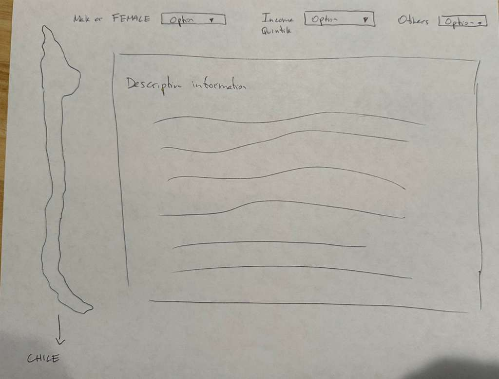
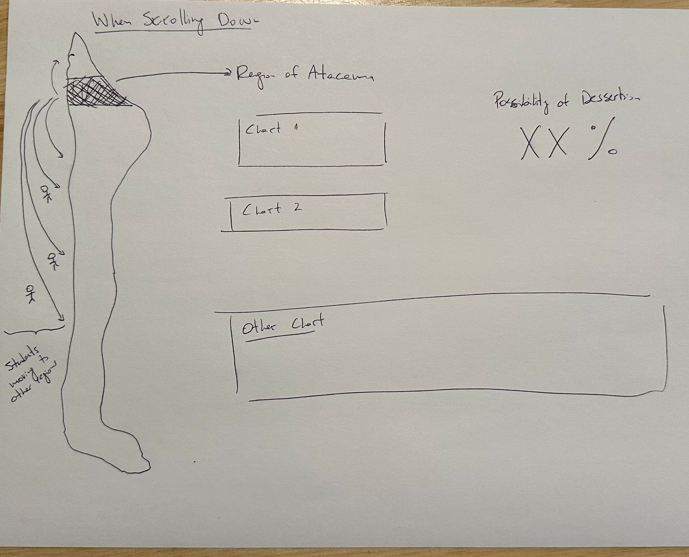

# Agustín Eyzaguirre

## Description

I'm going to continue working in my project from the Static Viz which had as a
topic how Higher Education is being financed in Chile, considering different public
policies implemented during the last 20 years (state-backed loans and
free-tuition policy for qualifiying students).

The purpose in this visualization is to show patterns and differences in how are 
people financing their education considering Chile's geography, where they are
coming from, and other factors.

This project has as a purpose to show the benefits of the public-policies implemented
despite the political critique that exists towards these financial instruments.

## Technical Plan re: Option A/B/C/D

I'm planning on option A to make one single major visualization.

I don't know too much about libraries, but according to the course content, my plan
is to use d3.js, HTML and JavaScript.

## Mockup

My plan is to take advantage of Chile's geography (long strip) and it's
political-administrative separation which consists mainly in portions of this
long strip that each one of them go from east to west [chile_geography](https://makegraph.app/map/chile).

That explained, the main point is to start defining some variables (income quintile,
origin region, others.) and that will calculate some algorithm which will show 
how much money was needed to study, and probability of graduating or desertion 
according to each region from north to south. For it, I'll use scrolling down 
to see the differences of it.

(Maybe I'm dreaming to much)

Here's an intent of drawed mockup:

**Welcoming page**

**When Scrolling down:**

## Data Sources

1. **Enrolled students in Higher Education in Chile 2007-2025.**
    
    Dataset containing details of enrolled students for every program, institution,
    year for the period 2007-2025.
    
    Source: Kaggle (User: Gustavo Reyes C.)
    
    Base Source: www.mifuturo.cl
    
    url: https://www.kaggle.com/datasets/gustavoreyesc/matriculados-en-educacin-superior-chile-2007-2025/data

    Shape: (264258, 59)

2. **Graduated students in Higher Education in Chile 2007-2024**
    
    Dataset containing details of graduation class for every program, institution,
    year for the period 2007-2024.
    
    Source: Kaggle (User: Gustavo Reyes C.)
    
    Base Source: www.mifuturo.cl
    
    url: https://www.kaggle.com/datasets/gustavoreyesc/titulados-en-educacin-superior-chile-2007-2024

    Shape: (218566, 42)

3. **Granted CAEs (State-backed student loans) for period 2006-2024**
    
    Dataset containing details of granted, renovation, in debt CAEs for the
    period 2006-2024.
    
    Source: Ingresa Committee (Institution responsible for administration of CAE)
    
    Base Source: https://portal.ingresa.cl/
    
    url: https://portal.ingresa.cl/estadisticas/estadisticas/

    Shape: (~12000000, 42)